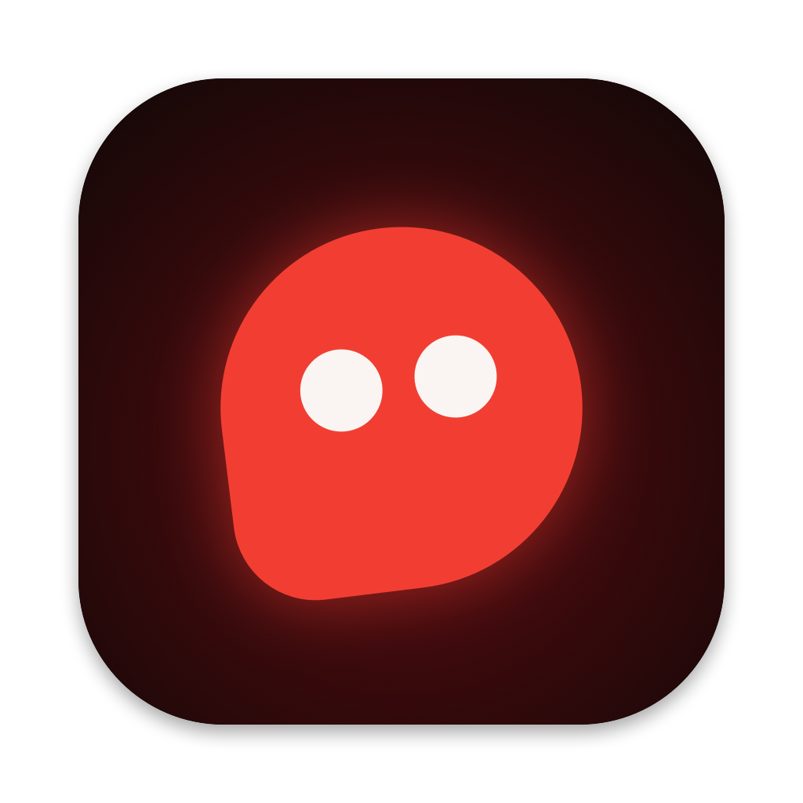

# crookcooked

Give your Mac the ability to protect itself against theft!

## Features

- Tamper detection while the Mac is locked, with an optional audible alarm.
- Encrypted alerts, photos, and clips sent to your iPhone over the local network.
- iPhone browser controls for arming, disarming, live view, and snapshots.

## Installation

Requires macOS 14 or newer.

Download `crookcooked-mac.zip` from [GitHub Releases](https://github.com/tbergkvist/crookcooked/releases/latest), unzip it, and move `crookcooked.app` to Applications.

Or just tell your agent to look at the repo and install it for you.

Build it yourself (Swift 6+): clone the repo and run `./scripts/build-mac-app.sh`. The app is in `dist/`.

## Usage

1. Open crookcooked with your Mac and iPhone on the same network. Scan the QR code with the iPhone Camera app and check that the six-digit verify codes match.
2. On the iPhone, tap **Start watching** and keep the page open. On the Mac, choose **arm & lock** and complete any required permission setup.
3. Tap **Disarm** on the iPhone or unlock macOS to stop protection. See [iPhone connection](docs/PHONE.md) for pairing help and watch-mode limitations.

## Contributing

See [contributor documentation](CONTRIBUTING.md).

## License

[MIT](LICENSE).

If you like it, star the repo.
